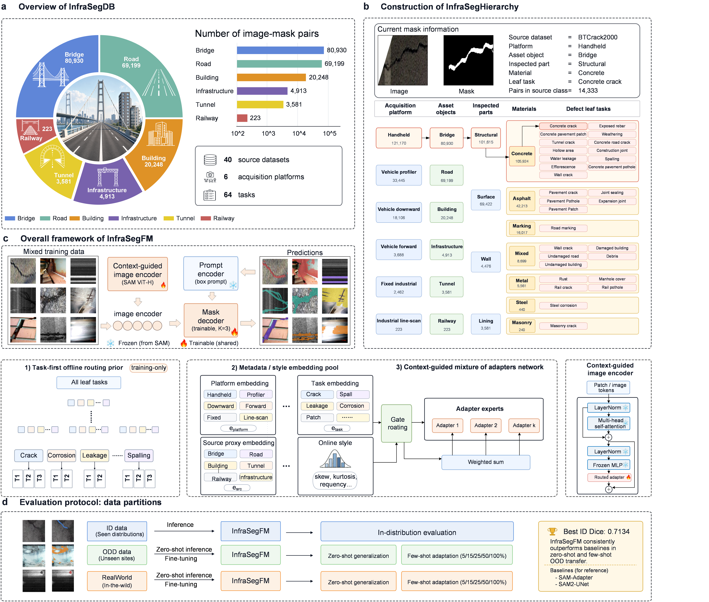
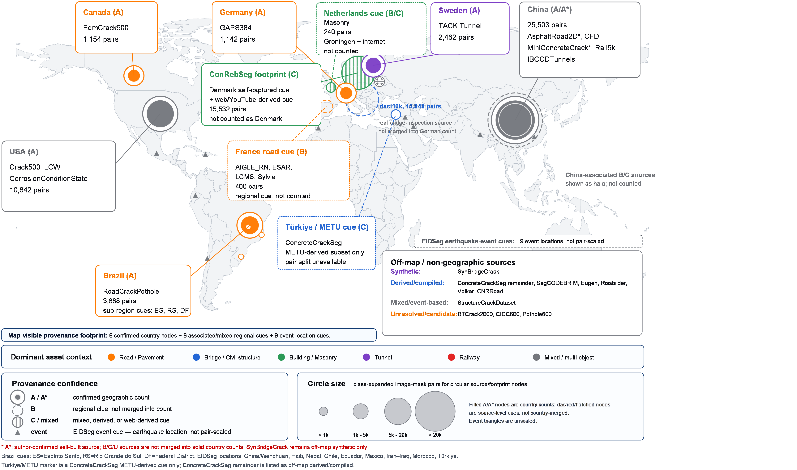
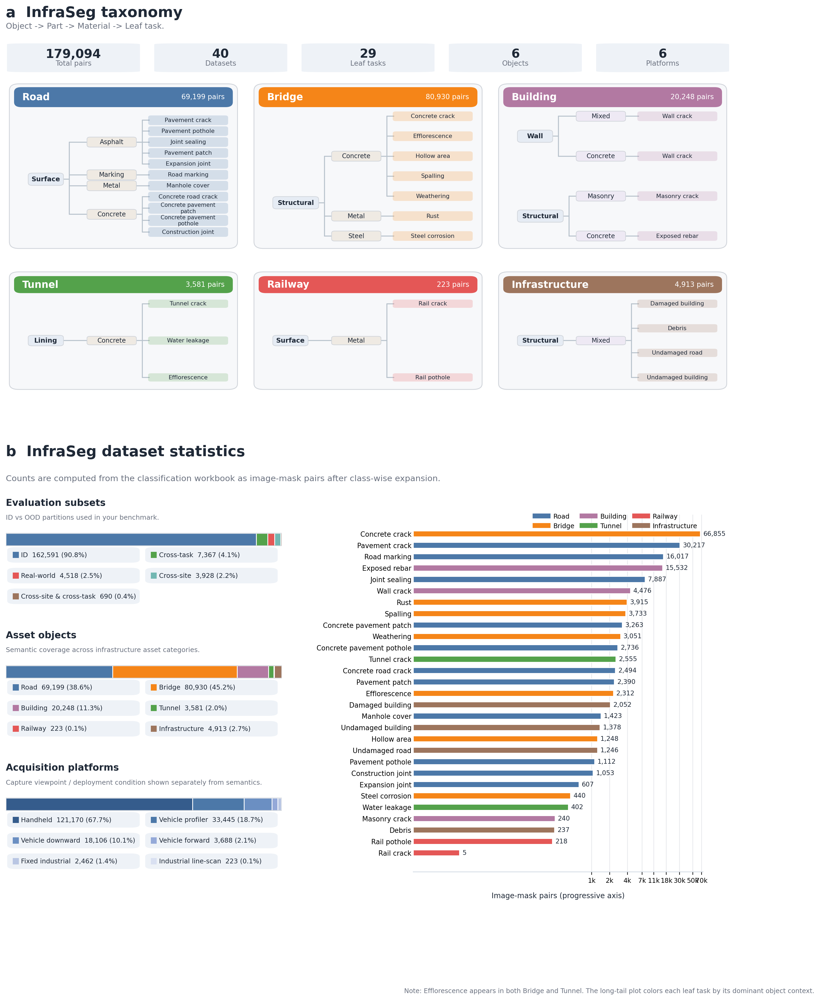
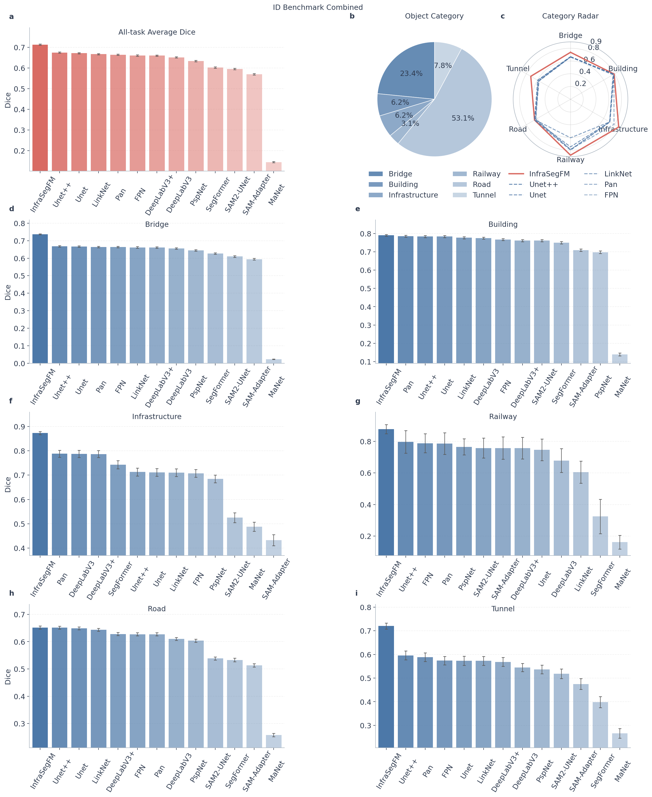
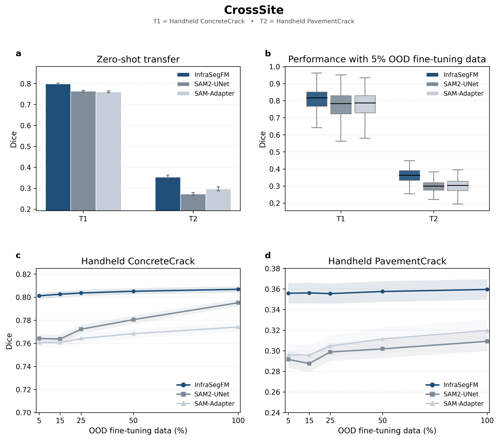
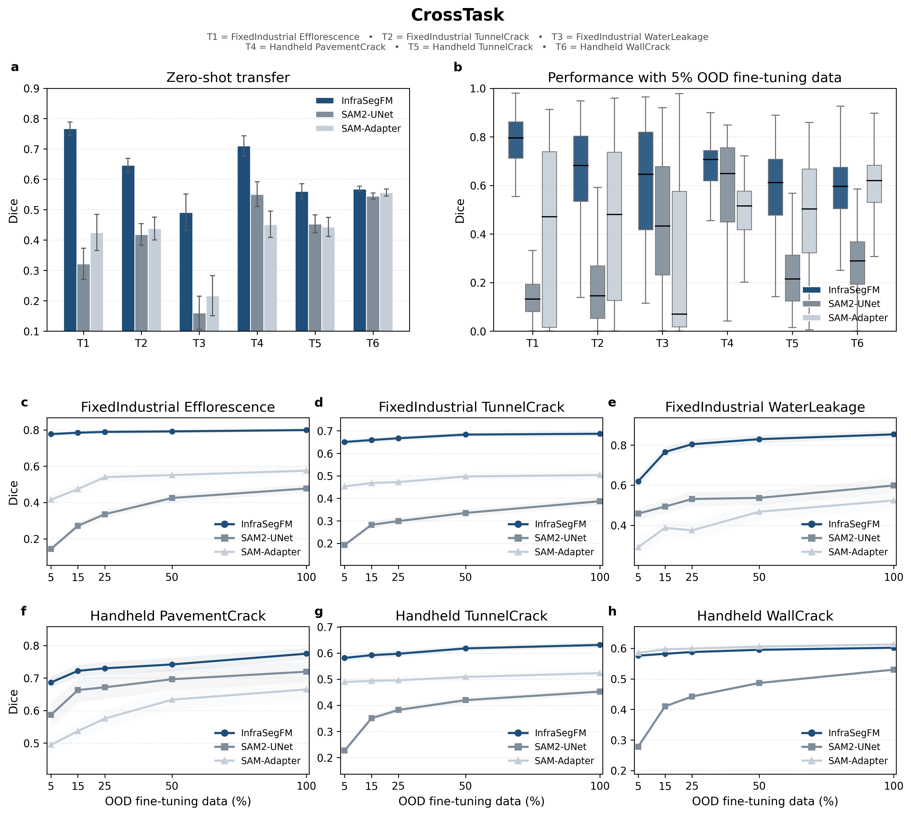
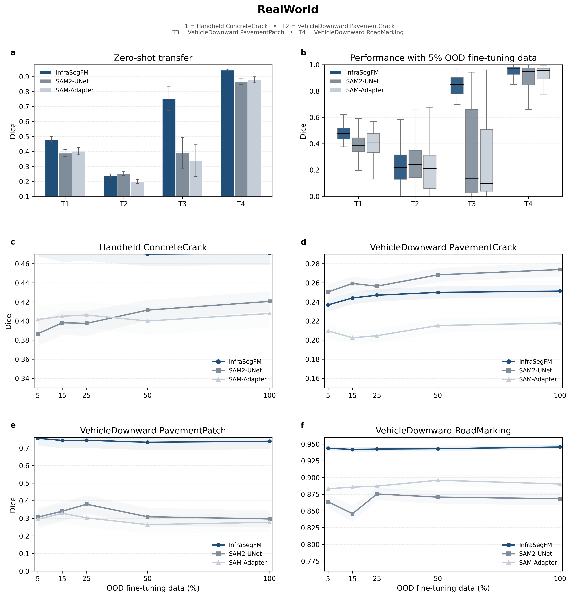
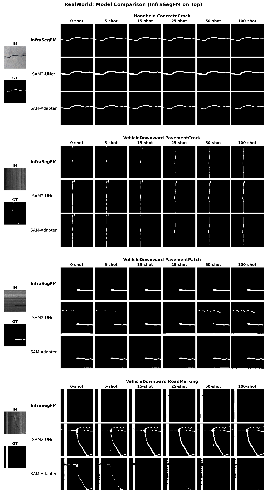

# InfraSegFM

[](pyproject.toml)
[](LICENSE)
[](https://github.com/facebookresearch/segment-anything)
[](MODEL_CARD.md)

Official implementation and release checkpoint for **InfraSegFM**, a
SAM-based framework for open-world civil infrastructure defect segmentation.

**Paper:** *A generalist foundation model and database for open-world civil infrastructure defect segmentation*

**Authors:** Baoxian Li, Yuyang Bao, Si Chen, Mingwei Fang, Longsheng Bao,
Jiakang Zhao, and Ling Yu

InfraSegFM freezes the SAM image and prompt encoders, then learns
metadata- and style-conditioned routed residual adapters together with the SAM
mask decoder. The repository provides the public release code, the InfraSegFM
ViT-B checkpoint, paper-default configuration, synthetic demo data, and
end-to-end scripts for training, evaluation, and prediction.

## Highlights

- **Generalist infrastructure segmentation:** one checkpoint for heterogeneous
  asset types, acquisition platforms, materials, and defect tasks.
- **SAM-based parameter-efficient adaptation:** frozen SAM encoders with
  trainable routed residual adapters and mask decoder weights.
- **Metadata/style-conditioned routing:** platform, hierarchy, task, source
  proxy, and online style statistics condition sparse expert selection.
- **Reproducible release package:** checkpoint manifest, model card, citation
  metadata, demo data, and train/evaluate/predict entry points.
- **Clear third-party boundary:** SAM source integration is documented and SAM
  weights are downloaded separately from the official Segment Anything release.

## Overview

<p align="center">
  
</p>

InfraSegFM is evaluated in the manuscript on InfraSegDB, a 179,094 image-mask
benchmark curated from 40 datasets and six acquisition platforms. The public
repository includes a synthetic mini benchmark for software verification; the
full InfraSegDB benchmark is not bundled in this release.

**Source provenance footprint**

<p align="center">
  
</p>

**Benchmark taxonomy and composition**

<p align="center">
  
</p>

## Results

Headline Dice scores reported in the manuscript:

| Setting | InfraSegFM Dice | Evaluation focus |
| --- | ---: | --- |
| In-distribution | 0.7134 | All-task supervised benchmark |
| CrossSite zero-shot | 0.7771 | Source and style transfer |
| CrossTask zero-shot | 0.5955 | New task and appearance distributions |
| RealWorld zero-shot | 0.5420 | Field-like noise, clutter, and degradation |

**In-distribution benchmark**

<p align="center">
  
</p>

**CrossSite transfer**

<p align="center">
  
</p>

**CrossTask transfer**

<p align="center">
  
</p>

**RealWorld evaluation**

<p align="center">
  
</p>

**Qualitative RealWorld comparison**

<p align="center">
  
</p>

## Release Contents

```text
InfraSegFM/
  assets/                         # README figures from the manuscript
  checkpoints/
    infrasegfm_vit_b.pth          # InfraSegFM ViT-B release checkpoint
    manifest.json                 # size and SHA256 hash for the release checkpoint
  configs/
    paper_vit_b.json              # paper-default hyperparameters
  demo_data/
    manifest.csv                  # synthetic demo split/task manifest
    train/, val/                  # synthetic multi-task mini benchmark
  infrasegfm/
    model.py                      # InfraSegFM and routed MoE adapters
    build.py                      # model factories
    dataset.py                    # dataset loaders
    moe_preassign.py              # route-prior cache builder
    losses.py, metrics.py
    segment_anything/             # lightly adapted SAM source code
  tools/
    make_demo_dataset.py
    train.py
    evaluate.py
    predict.py
  CITATION.cff
  MODEL_CARD.md
  requirements.txt
  pyproject.toml
```

## Installation

Create an environment:

```bash
git clone https://github.com/YuyangBaoo/InfraSegFM.git
cd InfraSegFM

python -m venv .venv
source .venv/bin/activate
python -m pip install --upgrade pip
```

Windows PowerShell:

```powershell
git clone https://github.com/YuyangBaoo/InfraSegFM.git
cd InfraSegFM

py -3.10 -m venv .venv
.\.venv\Scripts\Activate.ps1
python -m pip install --upgrade pip
```

Install PyTorch for your CUDA/CPU platform first. Example for CUDA 12.1:

```bash
pip install torch torchvision --index-url https://download.pytorch.org/whl/cu121
pip install -r requirements.txt
pip install -e .
```

For CPU-only machines, install the official CPU build of PyTorch, then run
`pip install -r requirements.txt`.

## Checkpoints

This repository redistributes the InfraSegFM release checkpoint only:

```text
checkpoints/
  infrasegfm_vit_b.pth
  manifest.json
```

Download the required SAM ViT-B checkpoint separately from Meta's official
Segment Anything release:

```bash
curl -L -o checkpoints/sam_vit_b_01ec64.pth \
  https://dl.fbaipublicfiles.com/segment_anything/sam_vit_b_01ec64.pth
```

Windows PowerShell:

```powershell
Invoke-WebRequest `
  -Uri "https://dl.fbaipublicfiles.com/segment_anything/sam_vit_b_01ec64.pth" `
  -OutFile "checkpoints\sam_vit_b_01ec64.pth"
```

Expected hashes:

| File | SHA256 |
| --- | --- |
| `checkpoints/infrasegfm_vit_b.pth` | `A6712C32BC9CB46465A689388DE4E6A611FBB7188ECE45150DB932019751A618` |
| `checkpoints/sam_vit_b_01ec64.pth` | `EC2DF62732614E57411CDCF32A23FFDF28910380D03139EE0F4FCBE91EB8C912` |

Verify locally:

```bash
# Linux/macOS
sha256sum checkpoints/*.pth

# Windows PowerShell
Get-FileHash checkpoints\*.pth -Algorithm SHA256
```

## Paper Defaults

The default command-line settings follow the original InfraSegFM Full workflow.

| Setting | Value |
| --- | --- |
| SAM backbone | `vit_b` |
| SAM input size | `256` |
| Training epochs | `30` |
| Fine-tuning epochs | `30` |
| Training batch size | `80` |
| Evaluation batch size | `50` |
| Pre-training LR | `5e-4` |
| Fine-tuning LR | `5e-5` |
| Weight decay | `0.01` |
| Mask decoder LR multiplier | `0.1` |
| Bottleneck dim / embedding dim | `16 / 16` |
| Experts | `4` |
| Gate top-k / temperature | `2 / 1.0` |
| MoE aux loss | load-balance `0.01`, entropy `0.01` |
| Route-prior supervision | enabled, coefficient `0.05` |
| AMP | recommended for full GPU runs |

The same record is saved in [configs/paper_vit_b.json](configs/paper_vit_b.json).

## Quick Smoke Test

The demo is a small synthetic mini benchmark for verifying the software path.
It is not used for paper metrics.

```text
demo_data/manifest.csv
train: 4 tasks x 12 samples
val:   4 tasks x 4 samples
```

Run a CPU smoke test:

```bash
python tools/make_demo_dataset.py --out demo_data --image_size 64 --overwrite
python tools/train.py --data_root demo_data --output_dir runs/demo --image_size 64 --epochs 1 --batch_size 8 --num_workers 0 --device cpu
python tools/evaluate.py --data_root demo_data/val --checkpoint runs/demo/model_best.pth --image_size 64 --batch_size 4 --num_workers 0 --device cpu --out_dir runs/demo_eval
```

Expected outputs:

```text
runs/demo/model_best.pth
runs/demo/history.csv
runs/demo_eval/metrics.csv
runs/demo_eval/summary.csv
```

After downloading the SAM ViT-B checkpoint, verify the release checkpoint on the
synthetic demo validation split:

```bash
python tools/evaluate.py \
  --data_root demo_data/val \
  --checkpoint checkpoints/infrasegfm_vit_b.pth \
  --sam_checkpoint checkpoints/sam_vit_b_01ec64.pth \
  --image_size 256 \
  --batch_size 1 \
  --num_workers 0 \
  --device cpu \
  --metrics dsc \
  --out_dir runs/demo_eval_release
```

## Dataset Format

Use one split directory and one task folder per defect type:

```text
your_dataset/
  train/
    Handheld_ConcreteCrack/
      npy_imgs/sample_001.npy
      npy_gts/sample_001.npy
    VehicleProfiler_AsphaltCrack/
      npy_imgs/sample_002.npy
      npy_gts/sample_002.npy
  val/
    Handheld_ConcreteCrack/
      npy_imgs/sample_101.npy
      npy_gts/sample_101.npy
```

Common image files are also supported:

```text
TaskFolder/
  images/sample_001.png
  masks/sample_001.png
```

Images and masks are paired by filename stem. Masks are binary; values greater
than zero are foreground.

Task folders should follow:

```text
<Platform>_<TaskName>
```

Examples:

```text
Handheld_ConcreteCrack
VehicleProfiler_AsphaltCrack
Handheld_ConcretePavementPothole
Aerial_RoadCrack
```

For new tasks or platforms, update [infrasegfm/taxonomy.py](infrasegfm/taxonomy.py).
This keeps the hierarchical metadata explicit and makes checkpoints
reproducible.

## Train

Paper-style training command:

```bash
python tools/train.py \
  --data_root /path/to/InfraSegDBv1 \
  --train_split train \
  --val_split val \
  --output_dir runs/InfraSegFM_vit_b \
  --sam_checkpoint checkpoints/sam_vit_b_01ec64.pth \
  --model_type vit_b \
  --image_size 256 \
  --epochs 30 \
  --batch_size 80 \
  --num_workers 2 \
  --lr 5e-4 \
  --device cuda:0 \
  --amp
```

The route-prior cache is built automatically:

```text
/path/to/InfraSegDBv1/train/_moe_routing_cache.json
```

The cache is deterministic for a fixed dataset and ignored by git.

## Fine-tune

Fine-tune from the release checkpoint or from a checkpoint produced by training:

```bash
python tools/train.py \
  --data_root /path/to/InfraSegDBCrossTask \
  --train_split train5 \
  --val_split val \
  --resume checkpoints/infrasegfm_vit_b.pth \
  --output_dir runs/InfraSegFM_vit_b_finetune_CrossTask_train5 \
  --sam_checkpoint checkpoints/sam_vit_b_01ec64.pth \
  --model_type vit_b \
  --image_size 256 \
  --epochs 30 \
  --batch_size 80 \
  --num_workers 2 \
  --lr 5e-5 \
  --device cuda:0 \
  --amp
```

## Evaluate Labeled Data

Use this path when your data has masks:

```bash
python tools/evaluate.py \
  --data_root /path/to/your_dataset/val \
  --checkpoint checkpoints/infrasegfm_vit_b.pth \
  --sam_checkpoint checkpoints/sam_vit_b_01ec64.pth \
  --model_type vit_b \
  --image_size 256 \
  --batch_size 50 \
  --num_workers 2 \
  --device cuda:0 \
  --metrics dsc hd \
  --out_dir runs/eval_val
```

Outputs:

```text
runs/eval_val/metrics.csv
runs/eval_val/summary.csv
```

## Predict Unlabeled Images

Use this path when users only have images and want masks. The script uses the
full image as the SAM box prompt by default. If you have object boxes from a
detector or manual annotation, pass `--box X1 Y1 X2 Y2`.

```bash
python tools/predict.py \
  --input /path/to/images \
  --output_dir runs/predict_my_images \
  --checkpoint checkpoints/infrasegfm_vit_b.pth \
  --sam_checkpoint checkpoints/sam_vit_b_01ec64.pth \
  --model_type vit_b \
  --image_size 256 \
  --task_folder Handheld_ConcreteCrack \
  --device cuda:0
```

Predicted masks are written to:

```text
runs/predict_my_images/masks/
```

If your task is not in the taxonomy, add it to
[infrasegfm/taxonomy.py](infrasegfm/taxonomy.py) first.

## Compatibility

This release is intentionally kept compatible with the original training and
evaluation workflow. Use the release checkpoint with the original evaluator:

```bash
python evaluate_internal.py \
  --data_path ./playground/eval/ID \
  --checkpoint ./InfraSegFM/checkpoints \
  --model_type vit_b \
  --model_weight ./InfraSegFM/checkpoints/infrasegfm_vit_b.pth \
  --device cuda:0 \
  --device_ids 0 \
  --batch_size 50 \
  --num_workers 2 \
  --pin_memory 0 \
  --metric dsc hd
```

Checkpoints produced by `tools/train.py` save the same adapter, context
embedding, style projection, gate, and mask decoder keys used by the original
`pretrain.py` / `finetune.py`.

## Reproducibility Checklist

When reporting results, record:

- Git commit hash.
- `configs/paper_vit_b.json`.
- SAM checkpoint name and SHA256.
- InfraSegFM checkpoint name and SHA256.
- Dataset split and task-folder taxonomy.
- PyTorch, CUDA, GPU model, and random seed.
- Exact training/evaluation command.

Keep these out of git:

```text
runs/
*_moe_routing_cache.json
private or full-scale datasets
```

## Data Availability

The full InfraSegDB benchmark is not included in this repository. This release
provides the implementation, the InfraSegFM checkpoint, paper-default
configuration, and a synthetic mini benchmark for reproducibility checks. Use
`demo_data/` only to verify the software pipeline, not to report model
performance.

## Third-party Code

The files under [infrasegfm/segment_anything](infrasegfm/segment_anything) are
lightly adapted from Meta AI's Segment Anything implementation. SAM is licensed
under Apache License 2.0; see [THIRD_PARTY_NOTICES.md](THIRD_PARTY_NOTICES.md)
and [LICENSES/Apache-2.0.txt](LICENSES/Apache-2.0.txt).

SAM model weights are not redistributed in this repository. Download
`sam_vit_b_01ec64.pth` from the official Segment Anything release URL before
running the release checkpoint.

## License

InfraSegFM-specific source code, docs, demo generation scripts, and release
metadata are provided under the MIT License. SAM-derived files retain their
Apache-2.0 notice.

## Citation

GitHub renders citation metadata from [CITATION.cff](CITATION.cff).

```bibtex
@misc{li2026infrasegfm,
  title  = {A generalist foundation model and database for open-world civil infrastructure defect segmentation},
  author = {Li, Baoxian and Bao, Yuyang and Chen, Si and Fang, Mingwei and Bao, Longsheng and Zhao, Jiakang and Yu, Ling},
  year   = {2026},
  note   = {Manuscript}
}
```
